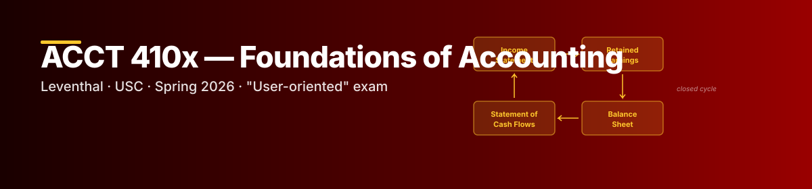

```{=html}

```

::: {.thesis}
**Strategy.** Leventhal's 410x is "user-oriented": the exam tests *what the number means for a manager*, not journal-entry mechanics. The April 20 tutoring brief identified four high-yield trap areas — and the existing Mock Final under-tests two of them. Drill the gaps.
:::

## Files in this section

- [Cheat Sheet](cheat-sheet.qmd) — formula reference for every section of the course
- [Mock Final](mock-final.qmd) — full-length practice exam with pedagogical key
- [Trap Drills](trap-drills.qmd) — **40 questions** layered on top of the mock to fill the gaps in trap B (multi-product CVP) and trap D (bond pricing)
- [Day-Of Playbook](day-of.qmd) — order of attack, time budget, pivot moves

## Strategic brief — read first


