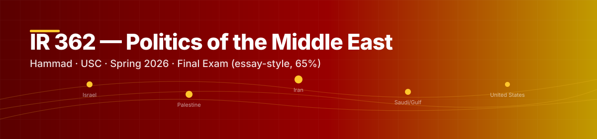

```{=html}

```

::: {.callout-warning appearance="default"}
**Heaviest weight on your transcript this term — 65% of your final grade.** Essay-format. Memorization of names + dates is required. Every page on this site is built to serve this exam.
:::

::: {.thesis}
**Master throughline.** The 17 study-guide questions revolve around three throughlines: (1) the **API → Abraham Accords pivot** — a regional shift from Palestine-centered linkage to security-and-economics linkage; (2) the **Nash equilibrium "carousel"** — a regional system stuck because each actor's strategy is a best response to the others; (3) **Iran's linkage role** — the engine connecting the Israeli-Palestinian sphere to the Gulf-security sphere via Hezbollah and Syria. Every essay you write should anchor itself to one or more of these throughlines and use specific dates, actors, and Hammad's lecture frames as its supporting beams.
:::

## Recommended reading order

For maximum yield given limited time, follow this sequence:

1. **This page** — read the framework for all 17 questions (below)
2. **[Iran & the Axis of Resistance](iran-axis.qmd)** — the deep-dive that addresses Q5, Q6, Q16, Q17 directly
3. **[Abraham Accords & Saudi Track](abraham-accords.qmd)** — Q1, Q3, Q4, Q7, Q8, Q9
4. **[Nash Equilibrium & the Carousel](nash-equilibrium.qmd)** — Q10, Q12, Q13, Q14, Q15, Q17
5. **[Syria — Alliance & 2024 Collapse](syria-collapse.qmd)** — Q5, Q6 (the freshest material in the entire exam)
6. **[Cram Sheet](cram-sheet.qmd)** — final-night condensation

Then return to this page and re-read the 17-question framework. The deep-dives will have changed how each question reads.

## Jump to a question

```{=html}
<div class="q-grid-legend">
  <strong>Throughline color:</strong>
  <span class="swatch" style="background:#990000"></span> Pivot (API↔Accords)
  <span class="swatch" style="background:#c79100"></span> Carousel (Nash)
  <span class="swatch" style="background:#5a0000"></span> Iran linkage
</div>
<div class="q-grid">
  <a class="throughline-pivot" href="#q1">Q1</a>
  <a class="throughline-pivot" href="#q2">Q2</a>
  <a class="throughline-pivot" href="#q3">Q3</a>
  <a class="throughline-pivot" href="#q4">Q4</a>
  <a class="throughline-iran" href="#q5">Q5</a>
  <a class="throughline-iran" href="#q6">Q6</a>
  <a class="throughline-pivot" href="#q7">Q7</a>
  <a class="throughline-pivot" href="#q8">Q8</a>
  <a class="throughline-pivot" href="#q9">Q9</a>
  <a class="throughline-carousel" href="#q10">Q10</a>
  <a class="throughline-pivot" href="#q11">Q11</a>
  <a class="throughline-carousel" href="#q12">Q12</a>
  <a class="throughline-carousel" href="#q13">Q13</a>
  <a class="throughline-carousel" href="#q14">Q14</a>
  <a class="throughline-carousel" href="#q15">Q15</a>
  <a class="throughline-iran" href="#q16">Q16</a>
  <a class="throughline-carousel" href="#q17">Q17</a>
</div>
<p style="font-size:.88rem;color:var(--bs-secondary-color);margin-top:-.4rem;">
🔁 Click any question above to jump · for full essay-style answers see <a href="sample-answers.html">📑 Full Sample Answers (17)</a>
</p>
```

---


