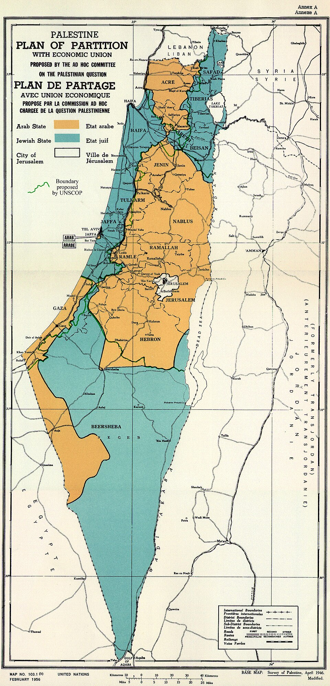
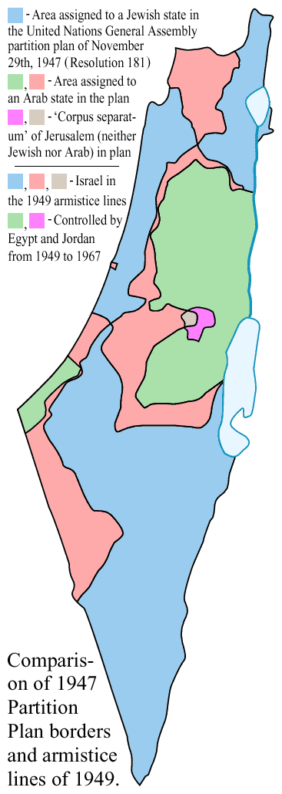
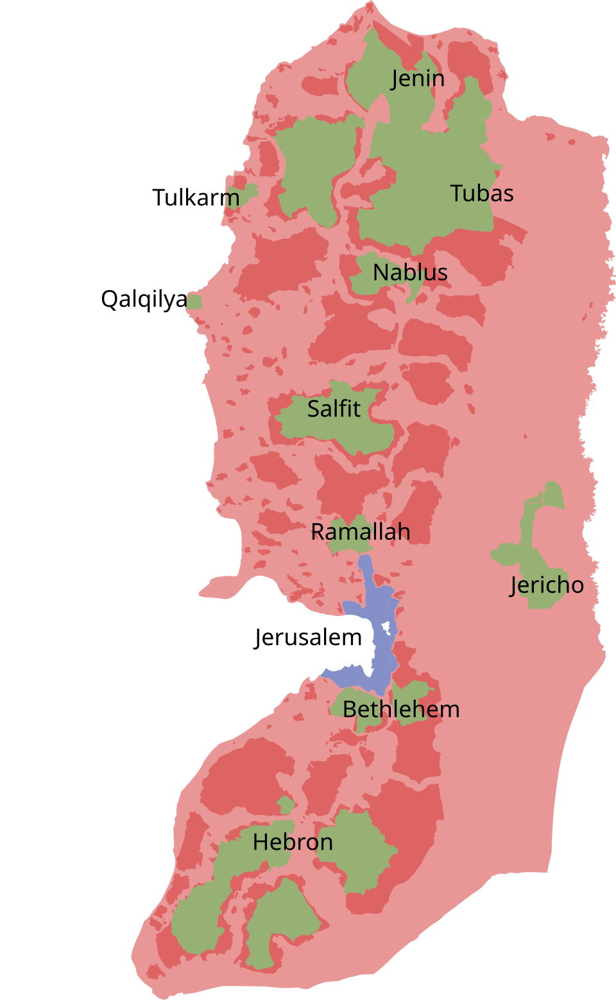
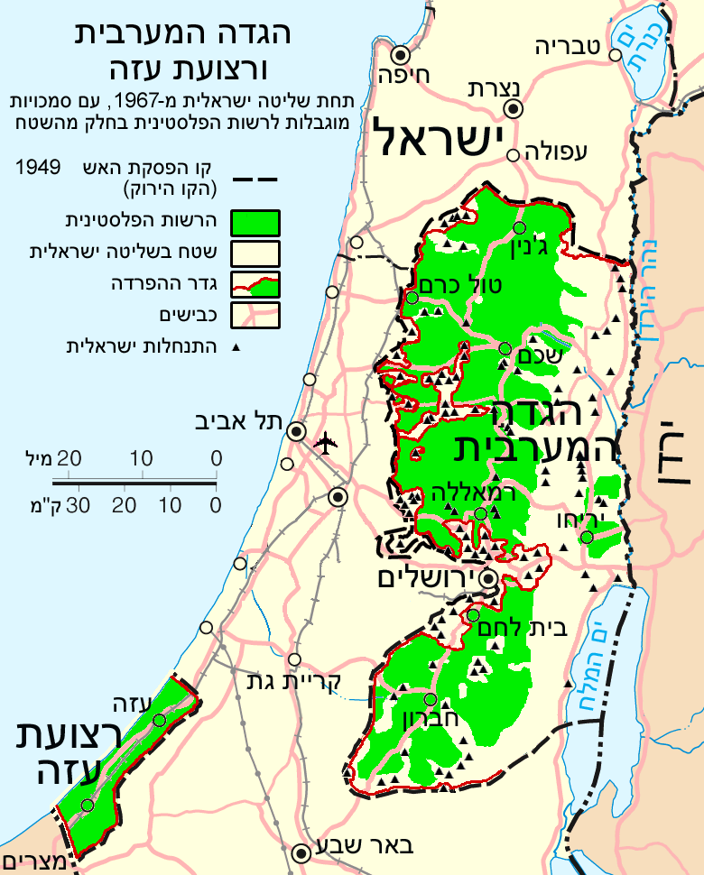
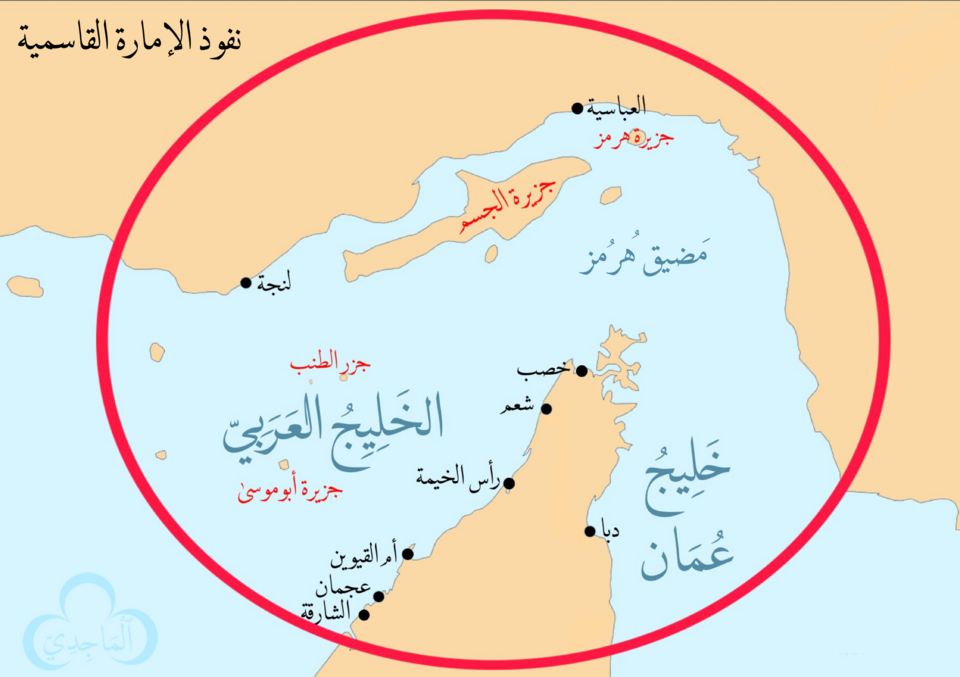
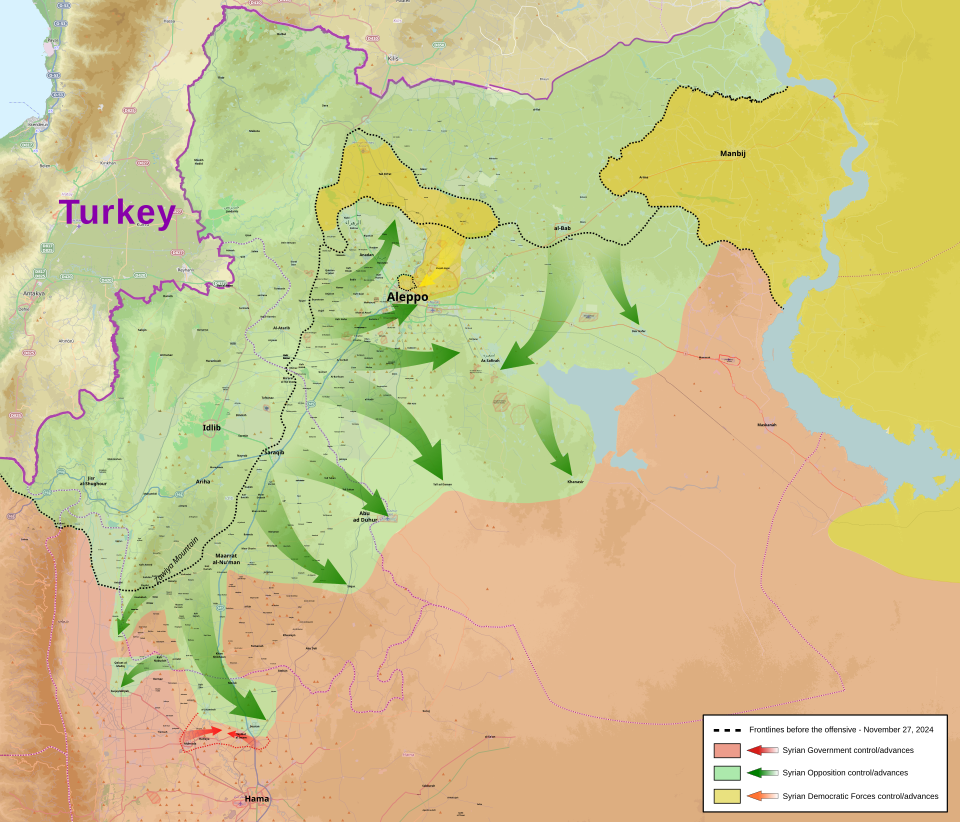

> Maps are the cheapest way to remember a complicated political geography. Each card has a "what to notice" prompt — read those before you re-read the maps, then quiz yourself.

::: {.map-gallery}

::: {.map-card}
{fig-alt="UN Partition Plan of 1947"}

::: {.map-body}
### 1947 UN Partition Plan
::: {.what-to-notice}
**What to notice:** the proposed Jewish state is a discontinuous patchwork of three lobes (Galilee, coast, Negev) connected by narrow corridors; the Arab state is similarly fragmented; Jerusalem is a *corpus separatum* under UN trusteeship. The map's geographic awkwardness is *why* both sides treated it as a starting bid rather than a final settlement — and why the 1948 war reshaped it almost immediately.
:::
::: {.cross-links}
[→ Primary source: UNGA 181](sources/unga-181.qmd) · [→ Timeline 1947 entry](timeline.qmd)
:::
:::
:::

::: {.map-card}
{fig-alt="Comparison of 1947 partition plan and 1949 armistice lines"}

::: {.map-body}
### 1949 Armistice Lines (the Green Line)
::: {.what-to-notice}
**What to notice:** the side-by-side of the 1947 plan and the 1949 armistices. Israel ended the war with ~78% of the territory rather than the 56% allocated by Partition; Jordan held the West Bank (annexed 1950) and Egypt held Gaza. The "Green Line" is the 1949 armistice — *not* an international border, which is why every later peace plan has had to argue about whether 242's "withdrawal" means to *the* lines or *some* lines.
:::
::: {.cross-links}
[→ UNSC 242 source](sources/unsc-242.qmd) · [→ Timeline 1948](timeline.qmd)
:::
:::
:::

::: {.map-card}
{fig-alt="Pre- and post-Six Day War territorial map"}

::: {.map-body}
### 1967 Territorial Expansion
::: {.what-to-notice}
**What to notice:** in six days Israel triples the territory under its control — Sinai (from Egypt), Gaza, the West Bank including East Jerusalem (from Jordan), the Golan Heights (from Syria). Sinai is later returned via Camp David (1979). The Golan is annexed 1981. The West Bank and Gaza remain occupied; the political and demographic consequences of that occupation are the substantive content of every Palestinian-Israeli question since.
:::
::: {.cross-links}
[→ UNSC 242 source](sources/unsc-242.qmd) · [→ Iran & Axis](iran-axis.qmd)
:::
:::
:::

::: {.map-card}
{fig-alt="West Bank Areas A, B, C under the Oslo II Accords"}

::: {.map-body}
### Oslo II Areas A / B / C
::: {.what-to-notice}
**What to notice:** Area A (full PA control, ~18% of WB) is an archipelago of urban islands; Area B (PA civil, joint security, ~22%) rings them; Area C (full Israeli control, ~60%) is the connective tissue including the Jordan Valley and most rural land. The "interim" division has now lasted 30+ years; every settlement expansion shrinks the practical basis for a contiguous Palestinian state.
:::
::: {.cross-links}
[→ Oslo I source](sources/oslo-i.qmd) · [→ Mitchell frame](frames/mitchell.qmd)
:::
:::
:::

::: {.map-card}
{fig-alt="Map of West Bank and Gaza showing settlements and the separation barrier"}

::: {.map-body}
### Settlements & the Separation Barrier
::: {.what-to-notice}
**What to notice:** the density of Israeli settlements clustered in a Jerusalem ring and along the Jordan Valley. The separation barrier (built mostly 2002–2010) frequently routes inside the Green Line, de facto annexing settlement blocs. The map makes visible the "creeping annexation" argument: that two-state outcomes have been physically pre-empted, not just politically blocked.
:::
::: {.cross-links}
[→ Hammad's Mitchell frame](frames/mitchell.qmd) · [→ Nash equilibrium](nash-equilibrium.qmd)
:::
:::
:::

::: {.map-card}
{fig-alt="Map of the Iran-led Axis of Resistance"}

::: {.map-body}
### Axis of Resistance (pre-2024)
::: {.what-to-notice}
**What to notice:** the geographic logic of Iran's regional reach — Tehran ↔ Baghdad (Shi'a militias) ↔ Damascus (Assad) ↔ Beirut (Hezbollah), plus the Yemen southern flank (Houthis) and Gaza partner (Hamas/PIJ). The key chokepoint was Syrian territory; that is exactly what Iran lost in December 2024, which is why this map is now a historical artifact.
:::
::: {.cross-links}
[→ Iran & Axis](iran-axis.qmd) · [→ Syria collapse](syria-collapse.qmd)
:::
:::
:::

::: {.map-card}
{fig-alt="Map of Iran's regional sphere of influence"}

::: {.map-body}
### Iran's Sphere of Influence
::: {.what-to-notice}
**What to notice:** the alternative framing of the same geography — overlapping zones of Iranian political, economic, and military reach. Compare with the Axis map: where they agree (Iraq, Lebanon) is where Iran's leverage is structural; where the influence map extends but the Axis map doesn't (parts of Afghanistan, the Gulf Shi'a populations) is where leverage is softer and more contested.
:::
::: {.cross-links}
[→ Iran & Axis](iran-axis.qmd) · [→ Gause frame](frames/gause.qmd)
:::
:::
:::

::: {.map-card}
{fig-alt="Map of Syria control during the late-2024 opposition offensive"}

::: {.map-body}
### Post-Assad Syria (early December 2024)
::: {.what-to-notice}
**What to notice:** the snapshot of the offensive — HTS-led forces racing south from Idlib through Aleppo, Hama, Homs in eleven days. The speed is the story: a regime that survived 13 years of civil war collapsed in under a fortnight once Russian air cover thinned, Hezbollah was decapitated, and Iran's resupply was severed. The map encodes the *interaction* of three external shocks.
:::
::: {.cross-links}
[→ Syria — alliance & collapse](syria-collapse.qmd) · [→ Timeline 2024](timeline.qmd)
:::
:::
:::

:::

---

## How to use these maps in an essay

- **Don't describe the map; argue with it.** "Notice that Area C is contiguous while Areas A and B are not — a Palestinian state on this geography would require Israeli land swaps or corridor concessions Israel has not been willing to make."
- **Pair two maps** to make a causal claim. The Axis map (pre-2024) plus the Syria-2024 control map make the "axis dismemberment" argument visible in two images.
- **Maps as counterfactual scaffolding.** "If the 1947 plan had been accepted, the Galilee/coast/Negev geography of the proposed Jewish state would have been the binding constraint" — this is more sophisticated than narrating events.
