> Scroll through the regional system in chronological order. Every card has the **date**, an image, the **two-sentence why-it-matters**, and a one-line **exam-ready phrasing** you can drop into an essay.

---

::: {.timeline-event}
::: {.text}
::: {.date}
2 November 1917
:::
::: {.title}
Balfour Declaration
:::
::: {.summary}
British Foreign Secretary Arthur Balfour writes Lord Rothschild that HMG views "with favour" a Jewish national home in Palestine while preserving the rights of "existing non-Jewish communities." It is the first great-power commitment to Zionism — and the foundational ambiguity of Israel/Palestine.
:::
::: {.one-liner}
"The regional 'Palestine question' begins not in 1948 but in a 67-word British letter that promised the same land twice."
:::
::: {.links}
[→ Primary source: full Balfour text](sources/balfour.qmd) · [→ Hammad's Brownlee–Masoud–Reynolds frame](frames/brownlee-masoud-reynolds.qmd)
:::
:::
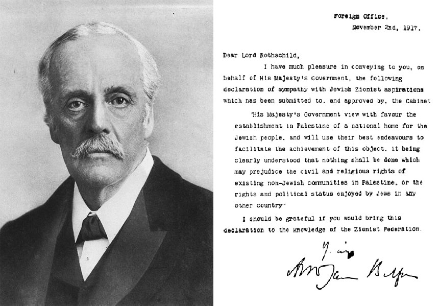{fig-alt="Portrait of Arthur Balfour beside a reproduction of the 1917 Declaration"}

::: {.caption}
Arthur Balfour with the text of the Declaration. Wikimedia Commons, public domain.
:::
:::

::: {.timeline-event .alt}
::: {.text}
::: {.date}
29 November 1947
:::
::: {.title}
UN Partition Plan (UNGA 181)
:::
::: {.summary}
The General Assembly votes 33–13 to partition Mandatory Palestine into a Jewish state, an Arab state, and an internationalised Jerusalem. The Yishuv accepts; the Arab Higher Committee and the Arab League reject. Civil war begins the next day.
:::
::: {.one-liner}
"UNGA 181 is the legal scaffold every later peace plan implicitly returns to — and the moment the regional system stopped being a colonial map."
:::
::: {.links}
[→ Primary source: UNGA 181](sources/unga-181.qmd)
:::
:::
{fig-alt="UN Partition Plan map of 1947 with proposed Jewish and Arab states"}

::: {.caption}
UN Palestine Partition map, 1947. Wikimedia Commons, public domain.
:::
:::

::: {.timeline-event}
::: {.text}
::: {.date}
14 May 1948
:::
::: {.title}
Israeli Independence + the Nakba
:::
::: {.summary}
Ben-Gurion proclaims the State of Israel; five Arab armies invade the next morning. By the 1949 armistices, Israel holds 78% of Mandate Palestine and ~750,000 Palestinians have been displaced — the *Nakba* ("catastrophe").
:::
::: {.one-liner}
"1948 simultaneously created a state and a refugee question; both still anchor the regional bargain."
:::
::: {.links}
[→ Iran & Axis of Resistance](iran-axis.qmd) · [→ Cram sheet](cram-sheet.qmd)
:::
:::
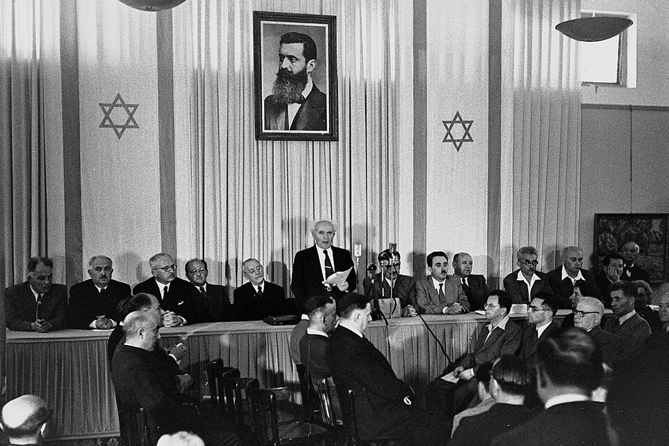{fig-alt="David Ben-Gurion declaring the establishment of the State of Israel beneath a portrait of Theodor Herzl"}

::: {.caption}
Declaration of the State of Israel, Tel Aviv, 14 May 1948. Wikimedia Commons, public domain.
:::
:::

::: {.timeline-event .alt}
::: {.text}
::: {.date}
October–November 1956
:::
::: {.title}
Suez Crisis
:::
::: {.summary}
After Nasser nationalises the Suez Canal, Britain, France, and Israel collude to invade. Eisenhower forces a humiliating Anglo-French withdrawal — ending European primacy in the region and crowning the US and USSR as the new external patrons.
:::
::: {.one-liner}
"Suez 1956 is the hinge from European to superpower order; every Cold War alignment in MENA flows from it."
:::
::: {.links}
[→ Hammad's Gause frame on regional security](frames/gause.qmd)
:::
:::
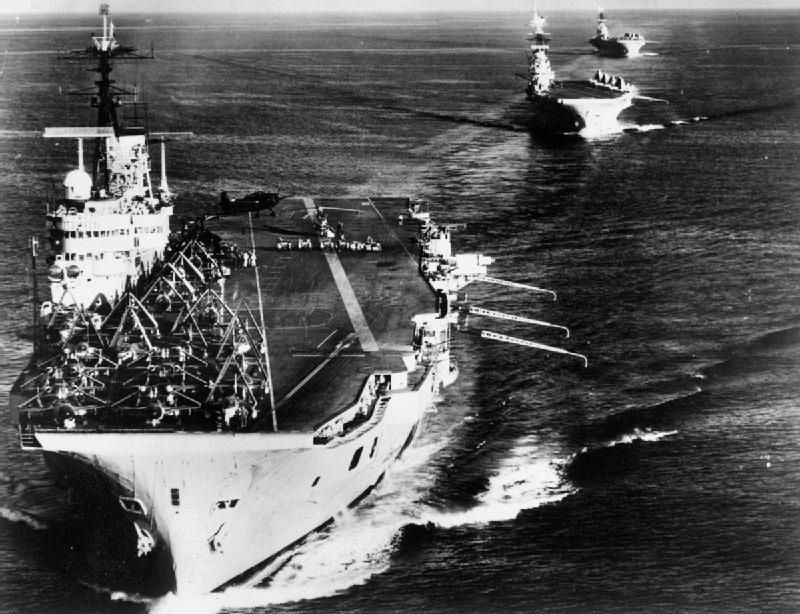{fig-alt="British aircraft carriers off Port Said during the Suez Crisis"}

::: {.caption}
British carriers during the Suez Crisis, 1956. Wikimedia Commons, public domain.
:::
:::

::: {.timeline-event}
::: {.text}
::: {.date}
5–10 June 1967
:::
::: {.title}
Six-Day War & UNSC 242
:::
::: {.summary}
Israel destroys the Egyptian, Jordanian, and Syrian air forces and seizes Sinai, Gaza, the West Bank, East Jerusalem, and the Golan Heights. UNSC 242 articulates "land for peace" — the formula that still structures every negotiation.
:::
::: {.one-liner}
"1967 produced the occupation that defines Israeli politics and the diplomatic formula (242) that defines every peace track."
:::
::: {.links}
[→ Primary source: UNSC 242](sources/unsc-242.qmd)
:::
:::
{fig-alt="Map showing territorial changes from the 1967 Six-Day War"}

::: {.caption}
Six-Day War territories, 1967. Wikimedia Commons, public domain.
:::
:::

::: {.timeline-event .alt}
::: {.text}
::: {.date}
6–25 October 1973
:::
::: {.title}
Yom Kippur / October War & UNSC 338
:::
::: {.summary}
Egypt and Syria launch a coordinated surprise attack on Yom Kippur; after early Arab gains Israel rallies, but the political shock breaks the post-1967 deadlock. UNSC 338 ties any settlement to 242 and triggers Kissinger's shuttle diplomacy.
:::
::: {.one-liner}
"1973 was a tactical Israeli recovery and a strategic Arab victory — it pushed Sadat toward Camp David."
:::
::: {.links}
[→ Primary source: UNSC 338](sources/unsc-338.qmd)
:::
:::
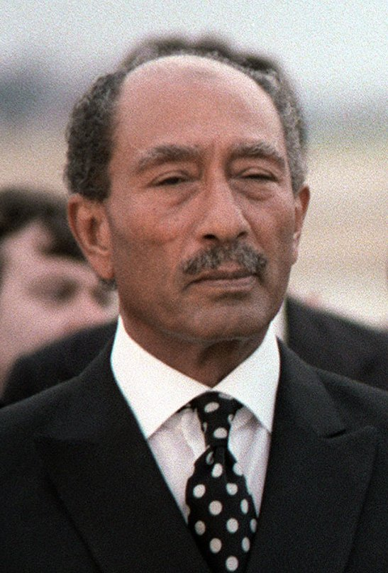{fig-alt="Portrait of Egyptian President Anwar Sadat"}

::: {.caption}
Anwar Sadat, who launched the October War and pivoted Egypt to peace. Wikimedia Commons, public domain.
:::
:::

::: {.timeline-event}
::: {.text}
::: {.date}
17 September 1978
:::
::: {.title}
Camp David Accords
:::
::: {.summary}
Carter, Sadat, and Begin reach the Camp David framework; the Egypt–Israel Treaty follows in March 1979. Egypt becomes the first Arab state to recognise Israel, exits the rejection front, and is suspended from the Arab League.
:::
::: {.one-liner}
"Camp David removed the largest Arab army from the war ledger and made bilateral peace the new template."
:::
::: {.links}
[→ Primary source: Camp David framework](sources/camp-david.qmd) · [→ Abraham Accords lineage](abraham-accords.qmd)
:::
:::
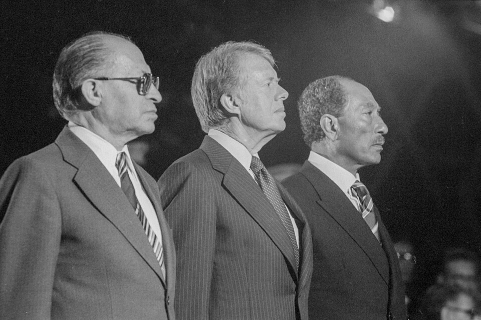{fig-alt="Begin, Carter, and Sadat at Camp David, September 1978"}

::: {.caption}
Begin, Carter, and Sadat at Camp David, 1978. US government, public domain.
:::
:::

::: {.timeline-event .alt}
::: {.text}
::: {.date}
1–11 February 1979
:::
::: {.title}
Iranian Revolution
:::
::: {.summary}
Khomeini returns to Tehran; the Shah's regime collapses; the Islamic Republic is founded by April referendum. The US loses its key Gulf pillar; Iran exits the pro-Western camp and begins building a transnational revolutionary project.
:::
::: {.one-liner}
"1979 birthed the Islamic Republic — and with it the Sunni–Shi'a regional cleavage that still structures every alliance."
:::
::: {.links}
[→ Iran & the Axis of Resistance](iran-axis.qmd)
:::
:::
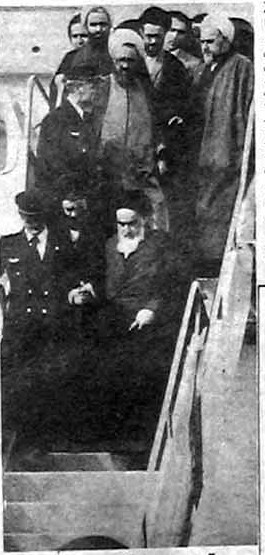{fig-alt="Ayatollah Khomeini portrait"}

::: {.caption}
Ayatollah Khomeini, leader of the 1979 revolution. Wikimedia Commons, public domain.
:::
:::

::: {.timeline-event}
::: {.text}
::: {.date}
6 June 1982
:::
::: {.title}
Israel Invades Lebanon · Hezbollah Founded
:::
::: {.summary}
Operation Peace for Galilee pushes the IDF to Beirut to expel the PLO; in the resulting vacuum Iran's Revolutionary Guards midwife Hezbollah from local Shi'a militias. The Iran–Lebanon corridor — and the Axis of Resistance — is born.
:::
::: {.one-liner}
"1982 is when Iran's regional reach becomes operational, not just rhetorical."
:::
::: {.links}
[→ Iran & the Axis of Resistance](iran-axis.qmd)
:::
:::
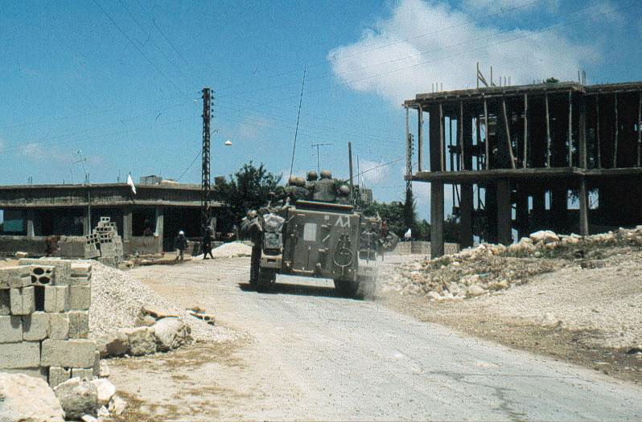{fig-alt="Israeli troops in southern Lebanon, 1982"}

::: {.caption}
Israeli troops in south Lebanon, 1982. Wikimedia Commons, public domain.
:::
:::

::: {.timeline-event .alt}
::: {.text}
::: {.date}
9 December 1987
:::
::: {.title}
First Intifada Begins
:::
::: {.summary}
A traffic incident in Gaza ignites a mass uprising of strikes, stone-throwing, and civil disobedience across the West Bank and Gaza. The Intifada propels Palestinian self-organisation, weakens external Arab tutelage, and pushes Israel toward direct negotiation.
:::
::: {.one-liner}
"The First Intifada turned the Palestinian question from an inter-state issue into a society-vs-occupation issue."
:::
::: {.links}
[→ Hammad's Mitchell frame on contentious politics](frames/mitchell.qmd)
:::
:::
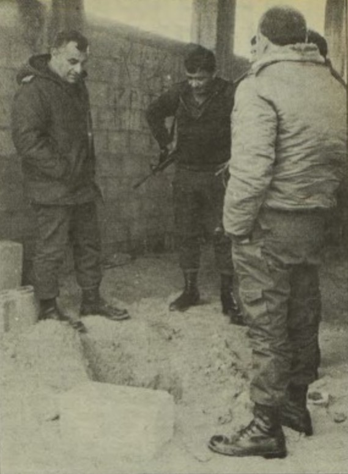{fig-alt="Scene from the First Intifada"}

::: {.caption}
First Intifada, late 1980s. Wikimedia Commons, public domain.
:::
:::

::: {.timeline-event}
::: {.text}
::: {.date}
13 September 1993
:::
::: {.title}
Oslo I Accord — White House Lawn
:::
::: {.summary}
Rabin and Arafat shake hands under Clinton; the PLO recognises Israel, Israel recognises the PLO as the Palestinian representative, and the Palestinian Authority is created. The Oslo process introduces Areas A/B/C and "interim status."
:::
::: {.one-liner}
"Oslo replaced rejectionism with phased autonomy — and froze a 'temporary' division of the West Bank that has now lasted three decades."
:::
::: {.links}
[→ Primary source: Oslo I](sources/oslo-i.qmd) · [→ Maps gallery](maps.qmd)
:::
:::
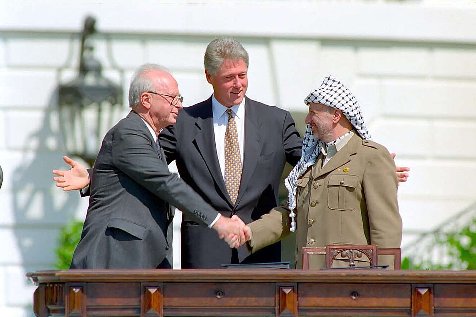{fig-alt="Clinton, Rabin, and Arafat at the South Lawn handshake, 13 September 1993"}

::: {.caption}
Clinton, Rabin, and Arafat at the White House, 1993. US government, public domain.
:::
:::

::: {.timeline-event .alt}
::: {.text}
::: {.date}
27–28 March 2002
:::
::: {.title}
Arab Peace Initiative (Beirut Summit)
:::
::: {.summary}
Saudi Crown Prince Abdullah's plan, adopted by the Arab League, offers full Arab normalisation in exchange for Israeli withdrawal to 1967 lines, a just refugee solution, and a Palestinian state. It re-bundles the bilateral peace tracks into a regional offer.
:::
::: {.one-liner}
"The 2002 API is the standing Arab counter-offer that every later track — Abraham Accords included — has had to address or evade."
:::
::: {.links}
[→ Primary source: API 2002](sources/api-2002.qmd) · [→ Abraham Accords](abraham-accords.qmd)
:::
:::
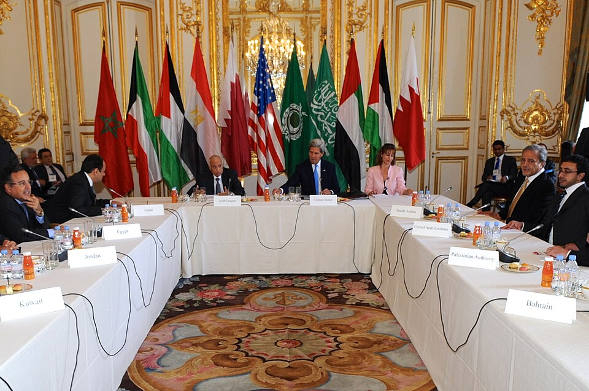{fig-alt="Arab Peace Initiative ministerial delegation"}

::: {.caption}
Arab Peace Initiative ministerial delegation. US State Department, public domain.
:::
:::

::: {.timeline-event}
::: {.text}
::: {.date}
20 March 2003
:::
::: {.title}
US Invasion of Iraq
:::
::: {.summary}
The US-led coalition topples Saddam Hussein; the de-Baathification and disbanding of the Iraqi army shatter the Sunni-led order. Iran becomes the principal regional winner, gaining a Shi'a-majority neighbour aligned in Baghdad and a corridor to Damascus and Beirut.
:::
::: {.one-liner}
"2003 is the unintended Iranian regional opening — Tehran's reach to the Mediterranean was paid for in US blood and treasure."
:::
::: {.links}
[→ Iran & the Axis](iran-axis.qmd) · [→ Hammad's Gause frame](frames/gause.qmd)
:::
:::
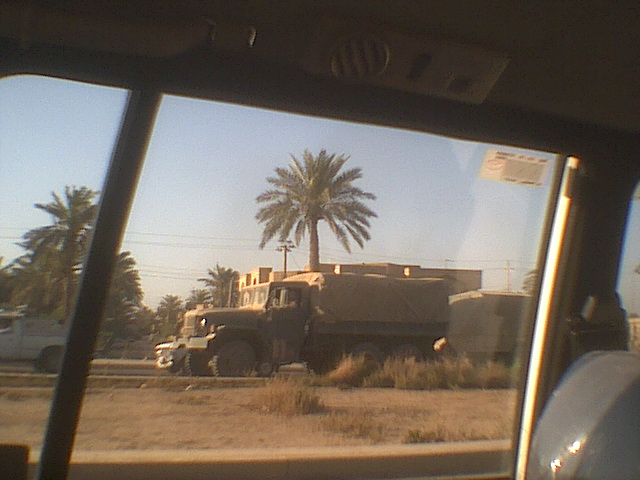{fig-alt="Iraq invasion, Baghdad, 2003"}

::: {.caption}
US forces in Baghdad, 2003. US government, public domain.
:::
:::

::: {.timeline-event .alt}
::: {.text}
::: {.date}
December 2010 – 2012
:::
::: {.title}
Arab Spring
:::
::: {.summary}
Bouazizi's self-immolation in Tunisia ignites uprisings across Tunisia, Egypt, Libya, Yemen, Bahrain, and Syria. Three regimes fall fast (Tunisia, Egypt, Libya); the Syrian and Yemeni cases collapse into long civil wars; Gulf monarchies survive via repression and rentier handouts.
:::
::: {.one-liner}
"The Arab Spring is the great natural experiment of the 2010s — a single shock, twelve different regime trajectories."
:::
::: {.links}
[→ Hammad's Bellin frame on durable authoritarianism](frames/bellin.qmd) · [→ Bayat frame](frames/bayat.qmd)
:::
:::
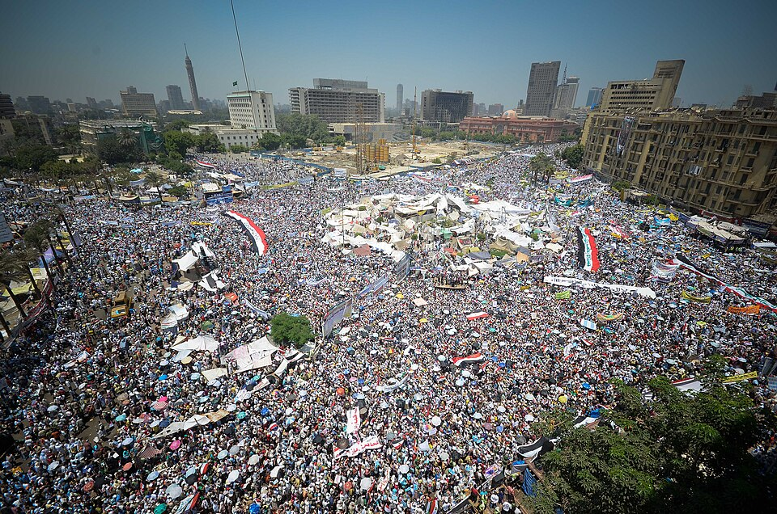{fig-alt="Tahrir Square, Cairo, July 2011"}

::: {.caption}
Tahrir Square, Cairo, 2011. Wikimedia Commons, CC-licensed.
:::
:::

::: {.timeline-event}
::: {.text}
::: {.date}
14 July 2015
:::
::: {.title}
JCPOA Signed in Vienna
:::
::: {.summary}
The P5+1 and Iran sign the Joint Comprehensive Plan of Action: Iran caps enrichment to 3.67%, ships out the bulk of its low-enriched uranium, and accepts intrusive IAEA monitoring in exchange for sanctions relief. Trump withdraws the US in May 2018.
:::
::: {.one-liner}
"The JCPOA is the only durable nuclear ceiling Iran has accepted — and Israel and Saudi Arabia were both willing to wreck the regional order to kill it."
:::
::: {.links}
[→ Iran & the Axis](iran-axis.qmd)
:::
:::
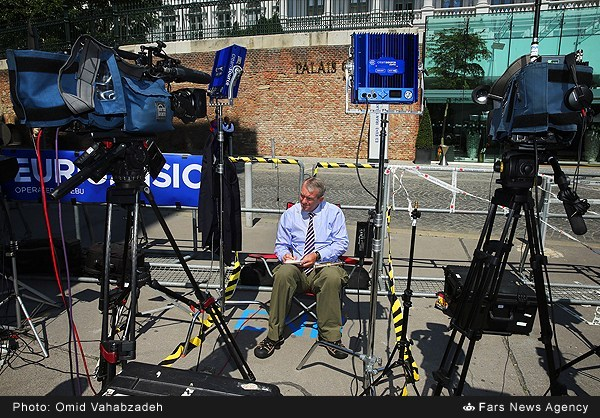{fig-alt="JCPOA negotiations in Vienna, 2015"}

::: {.caption}
JCPOA talks, Vienna, 2015. US State Department, public domain.
:::
:::

::: {.timeline-event .alt}
::: {.text}
::: {.date}
15 September 2020
:::
::: {.title}
Abraham Accords Signed
:::
::: {.summary}
Israel normalises with the UAE and Bahrain on the South Lawn; Sudan and Morocco follow within months. Normalisation is decoupled from Palestinian statehood for the first time — the API formula is officially inverted.
:::
::: {.one-liner}
"The Abraham Accords are the operational shift from 'land for peace' to 'peace for prosperity' — and the regional order Saudi-Israeli normalisation is built on top of."
:::
::: {.links}
[→ Abraham Accords deep dive](abraham-accords.qmd) · [→ Primary source: text](sources/abraham-accords-text.qmd)
:::
:::
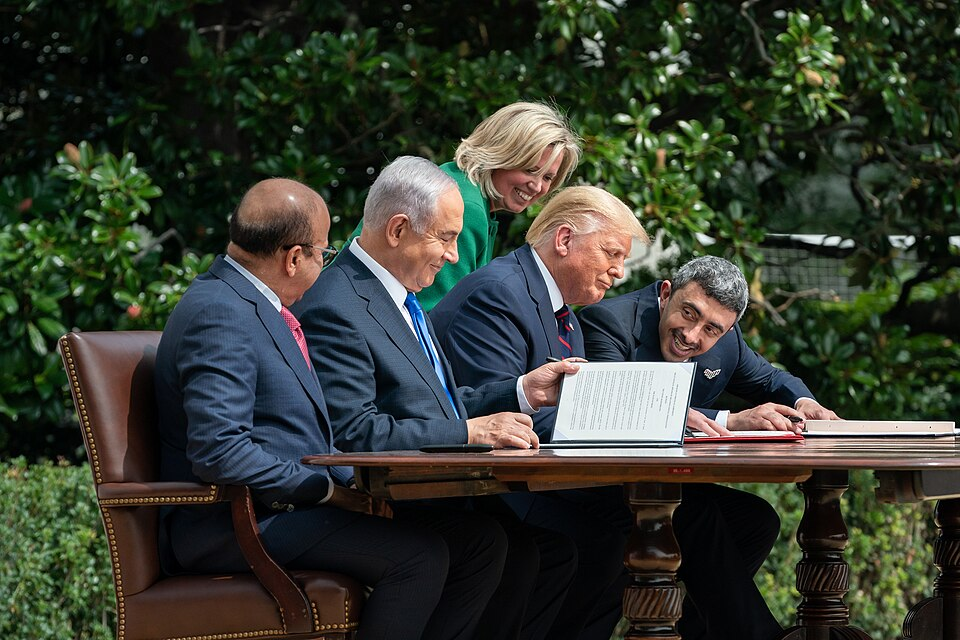{fig-alt="Abraham Accords signing ceremony, White House South Lawn"}

::: {.caption}
Abraham Accords signing, 15 September 2020. White House, public domain.
:::
:::

::: {.timeline-event}
::: {.text}
::: {.date}
10 March 2023
:::
::: {.title}
Saudi–Iran Rapprochement (Beijing)
:::
::: {.summary}
Riyadh and Tehran restore diplomatic relations under Chinese mediation, ending a seven-year freeze. The deal signals reduced US gatekeeping of Gulf security and Beijing's first major Middle East political brokerage.
:::
::: {.one-liner}
"Beijing 2023 is the moment China stops being the region's customer and becomes a political fixer."
:::
::: {.links}
[→ Nash equilibrium & the carousel](nash-equilibrium.qmd)
:::
:::
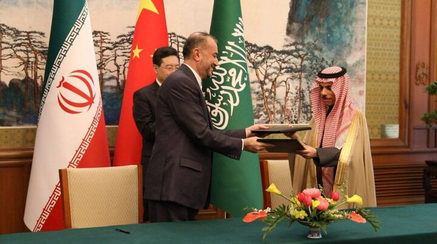{fig-alt="Saudi-Iran joint statement signing, Beijing 2023"}

::: {.caption}
Saudi–Iran joint statement signing, Beijing, March 2023. Wikimedia Commons.
:::
:::

::: {.timeline-event .alt}
::: {.text}
::: {.date}
7 October 2023
:::
::: {.title}
Hamas Attack & Gaza War Begins
:::
::: {.summary}
Hamas-led fighters breach the Gaza perimeter, killing roughly 1,200 Israelis and taking ~250 hostages; Israel launches a sustained military campaign in Gaza. The Saudi–Israeli normalisation track that had been weeks from announcement is paused.
:::
::: {.one-liner}
"October 7 is the veto event — the moment the Palestinian question forced its way back into the centre of every regional bargain."
:::
::: {.links}
[→ Nash equilibrium & the carousel](nash-equilibrium.qmd) · [→ Abraham Accords aftermath](abraham-accords.qmd)
:::
:::
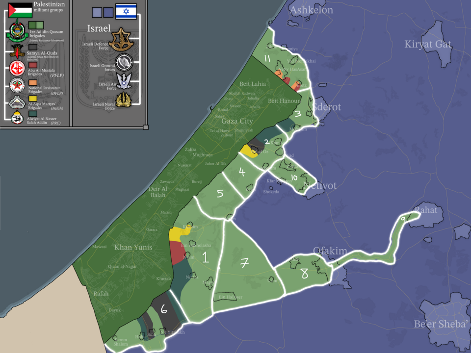{fig-alt="Map of southern Israel and Gaza Strip showing locations relevant to the October 7 events"}

::: {.caption}
Map of southern Israel / Gaza area. Wikimedia Commons, CC-licensed.
:::
:::

::: {.timeline-event}
::: {.text}
::: {.date}
27 September 2024
:::
::: {.title}
Nasrallah Killed; Israel–Hezbollah War Intensifies
:::
::: {.summary}
Israel kills Hezbollah Secretary-General Hassan Nasrallah in a Beirut strike following the pager and walkie-talkie attacks; a ground operation pushes into south Lebanon. Hezbollah's senior command is decimated and its deterrent posture collapses.
:::
::: {.one-liner}
"The 2024 decapitation of Hezbollah is the operational removal of Iran's most credible deterrent — and the precondition for everything that follows in Syria."
:::
::: {.links}
[→ Iran & the Axis](iran-axis.qmd) · [→ Syria collapse](syria-collapse.qmd)
:::
:::
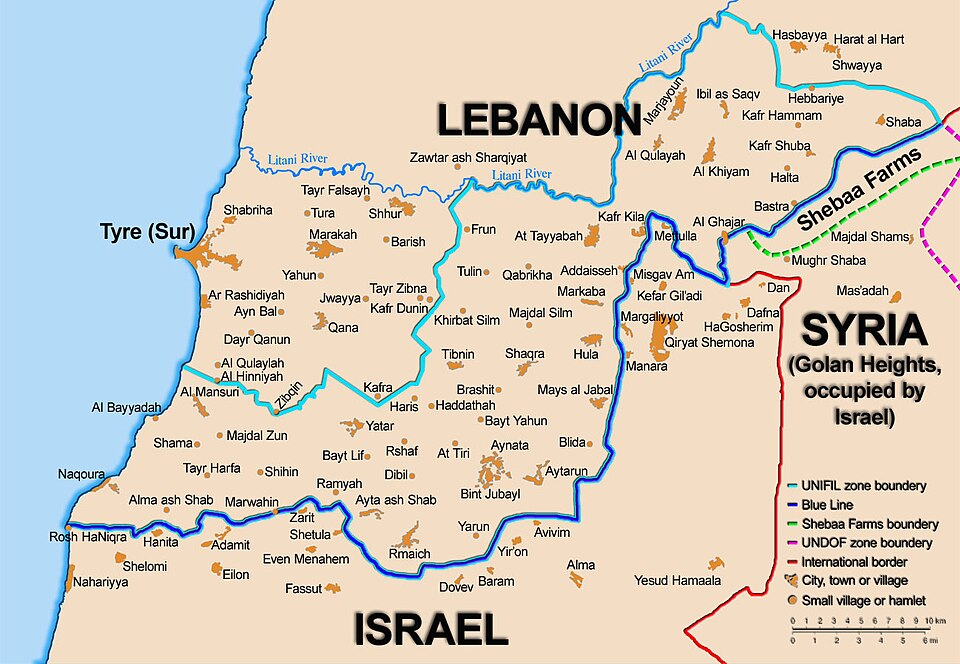{fig-alt="Blue Line map showing Israel-Lebanon border and southern Lebanon"}

::: {.caption}
The Blue Line, Israel–Lebanon border. Wikimedia Commons, public domain.
:::
:::

::: {.timeline-event .alt}
::: {.text}
::: {.date}
8 December 2024
:::
::: {.title}
Damascus Falls; Assad Flees to Russia
:::
::: {.summary}
Hayat Tahrir al-Sham–led forces under Ahmed al-Sharaa enter Damascus after an 11-day offensive; Bashar al-Assad flees to Moscow. Fifty-four years of Assad rule end; Iran's land-bridge to Hezbollah is severed.
:::
::: {.one-liner}
"The fall of Damascus is the operational dismemberment of the Axis of Resistance — Tehran loses Syria, Hezbollah loses resupply, and the Levant rebooks itself overnight."
:::
::: {.links}
[→ Syria — alliance & collapse](syria-collapse.qmd)
:::
:::
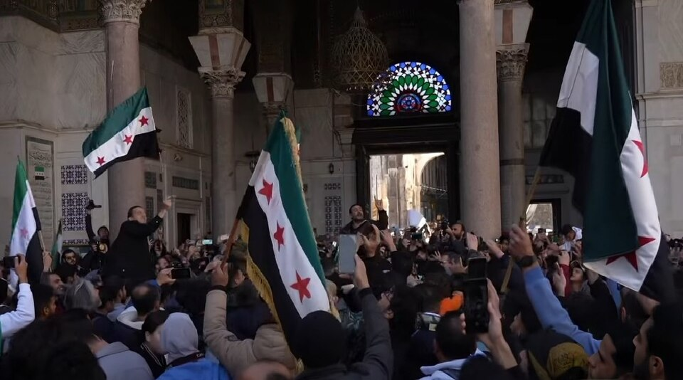{fig-alt="Crowds at the Umayyad Mosque, Damascus, December 2024"}

::: {.caption}
Crowds at the Umayyad Mosque, Damascus, 14 December 2024. Wikimedia Commons, CC-licensed.
:::
:::

::: {.timeline-event}
::: {.text}
::: {.date}
2025
:::
::: {.title}
Sharaa Transition; Sectarian Incidents
:::
::: {.summary}
Ahmed al-Sharaa is named transitional president; his government negotiates with Western capitals, lifts sanctions in stages, and absorbs SDF formations. Sectarian flare-ups in the Alawite coast (March), Druze south (Suweida, July), and elsewhere expose the fragility of the new order.
:::
::: {.one-liner}
"2025 is the test of whether post-Assad Syria can become a state again — early signs are mixed, with diplomatic legitimacy outpacing internal cohesion."
:::
::: {.links}
[→ Syria — alliance & collapse](syria-collapse.qmd)
:::
:::
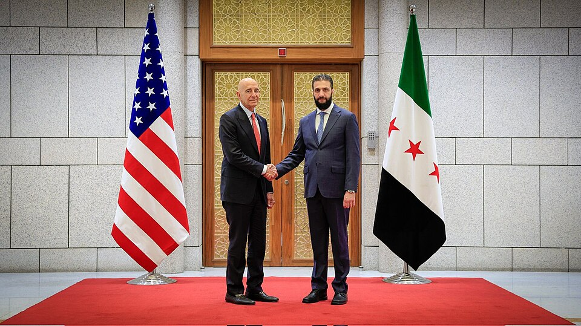{fig-alt="US envoy Tom Barrack meeting Ahmed al-Sharaa in Damascus, May 2025"}

::: {.caption}
Sharaa meets US envoy Tom Barrack, May 2025. US State Department, public domain.
:::
:::

::: {.timeline-event .alt}
::: {.text}
::: {.date}
2026 (now)
:::
::: {.title}
Saudi–Israeli Normalisation Track · Ongoing Gaza/West Bank
:::
::: {.summary}
The Riyadh–Jerusalem track is back on the table conditional on a credible Palestinian political horizon; meanwhile Gaza reconstruction stalls and West Bank settlement expansion accelerates. The regional system is mid-transition: post-Axis, pre-settlement.
:::
::: {.one-liner}
"2026 is the regional system between equilibria — the old Axis is broken, the new normalisation order is unfinished, and the Palestinian question is the binding constraint on both."
:::
::: {.links}
[→ Nash equilibrium](nash-equilibrium.qmd) · [→ Cram sheet](cram-sheet.qmd) · [→ Maps gallery](maps.qmd)
:::
:::
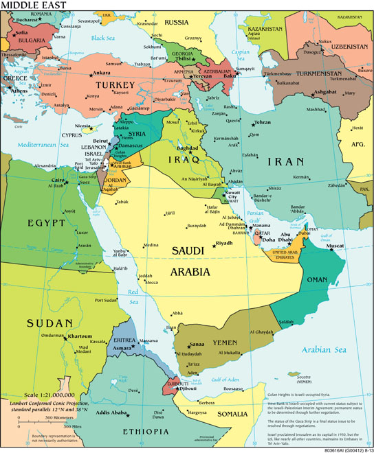{fig-alt="Political map of the Middle East and North Africa"}

::: {.caption}
CIA World Factbook political map of the Middle East. US government, public domain.
:::
:::

---

## How to use this page in an essay

1. **Pick three moments from different decades** as the spine of your argument (e.g. 1948 → 1979 → 2024). Continuity vs. rupture writes itself.
2. **Use the one-liner** as the topic sentence of the paragraph that introduces each moment.
3. **Cross-link the deep-dive** for the analytical machinery (causal mechanism, frame, counterfactual).

See the [Mock Essays](mock-essays.qmd) page for graded sample answers that do exactly this.
