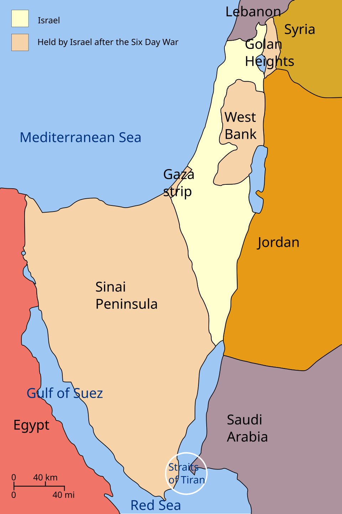
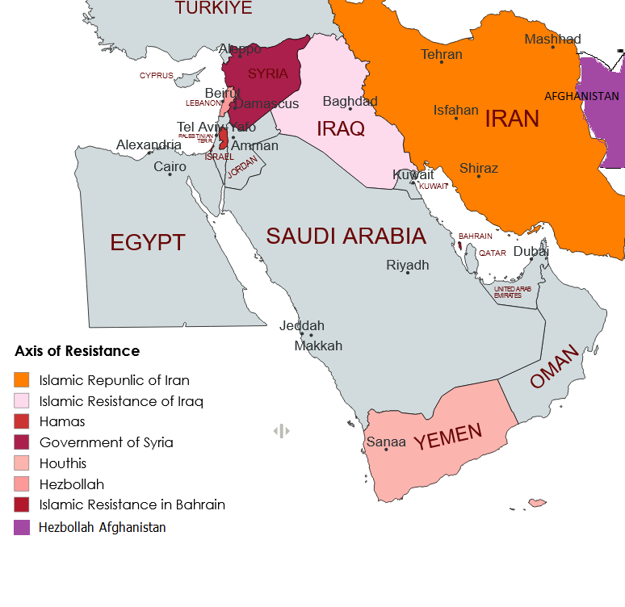

```{=html}
<div class="walk-progress" aria-label="Walkthrough progress">
  <div class="walk-progress-fill" style="width: 0%"></div>
  <div class="walk-progress-label">0 of 9 stops</div>
</div>

<section class="stop">
  <div class="stop-header">
    <span class="stop-num">STOP 0</span>
    <span class="stop-time">1 min</span>
    <span class="stop-progress">0 / 8</span>
  </div>
```

## Before we start

This page is the whole exam, told as a story, in eight stops. Each one ends with a single small thing to do. By the time you reach the end you'll have written enough that the essay tomorrow will feel like recall, not invention.

Eight stops. Roughly seventy-five minutes if you keep moving. The ground we cover: the spine of the regional story, the API-to-Accords pivot, the four key actors, the game-theoretic logic, Iran's engine, the four frames Hammad rewards, an essay scaffold you can lift directly, and a final pass.

```{=html}
<figure>
  
  <figcaption>Ben-Gurion reads the Declaration of Independence, Tel Aviv, 14 May 1948 — the founding rupture.</figcaption>
</figure>
```

```{=html}
  <div class="do-this">Take a breath. Scroll down. One stop at a time.</div>
  <label class="stop-complete">
    <input type="checkbox" data-stop="0">
    <span>I worked through this stop. ✓</span>
  </label>
</section>

<section class="stop">
  <div class="stop-header">
    <span class="stop-num">STOP 1</span>
    <span class="stop-time">8–10 min</span>
    <span class="stop-progress">1 / 8</span>
  </div>
```

## The story in one page

If you had to tell someone the entire Middle East story in 90 seconds, where would you start?

Start in **London, 1917**. A British foreign secretary writes a letter promising "a national home for the Jewish people" in a place his country doesn't yet control. Balfour's letter is the seed of the Mandate, and the Mandate is the trellis everything else grows along.

```{=html}
<figure>
  
  <figcaption>1917 · The Balfour letter — a promise made by a state that didn't yet hold the land.</figcaption>
</figure>
```

Skip to **Lake Success, 1947**. The newly minted UN passes Resolution 181 — partition. Arab states reject it. On **14 May 1948**, Ben-Gurion declares Israel; five Arab armies move in; by 1949 Israel holds more land than partition gave it, and around 750,000 Palestinians are displaced — the Nakba. This is the founding rupture: two narratives, one geography.

```{=html}
<figure>
  
  <figcaption>1947 · UNGA 181 — the partition plan that became the legal scaffolding for Israeli independence.</figcaption>
</figure>
```

Now **June 1967**. Six days. Israel takes the West Bank, Gaza, the Sinai, the Golan. UN Security Council Resolution **242** invents the doctrine "land for peace" — withdrawal in exchange for recognition. Every diplomatic move for the next half-century stands on top of 242.

```{=html}
<figure>
  
  <figcaption>1967 · The map after the Six-Day War — Israel quadruples its territory; "land for peace" enters the lexicon.</figcaption>
</figure>
```

**Camp David, September 1978**. Sadat, Begin, Carter on a wooded Maryland hilltop. Egypt — the largest Arab military — signs a separate peace and gets the Sinai back. The Arab League suspends Egypt for a decade. The pan-Arab veto on dealing with Israel is broken. Once one Arab state walks away from the linkage, the question becomes when, not whether, others will follow.

```{=html}
<figure>
  
  <figcaption>1978 · Camp David — the first Arab break with the Palestinian-precondition consensus.</figcaption>
</figure>
```

**Tehran, February 1979**. Khomeini steps off a plane from Paris to a city in revolt. Iran flips overnight from US ally to adversary. In **1982**, Israel invades Lebanon, and out of the wreckage the Iranian Revolutionary Guard helps midwife **Hezbollah** in the Bekaa Valley. The flag of Palestinian armed struggle, until then carried by secular Arab nationalists, gets handed to a new bearer: an Iranian-aligned Shia Islamist movement on Israel's northern border.

```{=html}
<figure>
  
  <figcaption>1979 · Khomeini lands in Tehran. Iran flips. The axis of resistance has its future patron.</figcaption>
</figure>
```

The **1990s** try diplomacy. Madrid 1991, Oslo I in **1993** on the White House lawn — Rabin and Arafat shake hands — Oslo II 1995, Rabin assassinated November 1995. The **Second Intifada** (2000–2005) ends Oslo as a living process. In **2002**, Saudi Crown Prince Abdullah floats the **Arab Peace Initiative** at the Beirut Summit: full Arab normalization in exchange for full Israeli withdrawal to 1967 lines and a Palestinian state. The API will sit on the shelf for two decades, but it remains the regional template.

```{=html}
<figure>
  
  <figcaption>1993 · Oslo — the high-water mark of two-state diplomacy.</figcaption>
</figure>
```

Then the pivot. **August 2020**: UAE normalizes with Israel. Bahrain follows in September, Sudan in October, Morocco in December — the **Abraham Accords**. No Palestinian state, no withdrawal — security cooperation against Iran and economic upside instead. Three years later, on **7 October 2023**, Hamas breaks through the Gaza fence and the regional system convulses. Through 2024 Israel decapitates Hezbollah's leadership; on **8 December 2024** Damascus falls and Assad flees to Moscow; Iran's land bridge is severed.

```{=html}
<figure>
  
  <figcaption>8 December 2024 · Damascus falls. The structural shock of the decade.</figcaption>
</figure>
```

That's the spine. Seven scenes: 1917, 1948, 1967, 1978, 1979/1982, 1993/2002, 2020/2023/2024.

```{=html}
  <div class="do-this">Close this tab. On paper, in three sentences, tell yourself this story. Then come back.</div>
  <label class="stop-complete">
    <input type="checkbox" data-stop="1">
    <span>I worked through this stop. ✓</span>
  </label>
</section>

<section class="stop">
  <div class="stop-header">
    <span class="stop-num">STOP 2</span>
    <span class="stop-time">8–10 min</span>
    <span class="stop-progress">2 / 8</span>
  </div>
```

## The pivot

If 2002's Arab Peace Initiative said *normalize Israel only after a Palestinian state*, and the 2020 Abraham Accords said *normalize Israel without a Palestinian state*, what changed?

Hold these two side by side.

```{=html}
<div class="scene-pair">
  <div>
    
    <h3>API · 2002</h3>
    <p><strong>Where:</strong> Beirut Summit, March 2002.<br>
    <strong>Who:</strong> Saudi Crown Prince Abdullah; endorsed by all 22 Arab League states.<br>
    <strong>The deal:</strong> Full normalization with Israel <em>after</em> Israeli withdrawal to 1967 lines and the establishment of a Palestinian state with East Jerusalem as its capital.<br>
    <strong>Logic:</strong> Palestinian statehood is the <em>price</em> of normalization. Sequencing: state first, peace second.</p>
  </div>
  <div>
    
    <h3>Abraham Accords · 2020</h3>
    <p><strong>Where:</strong> White House South Lawn, Washington.<br>
    <strong>Who:</strong> UAE 13 Aug, Bahrain 11 Sept, Sudan 23 Oct, Morocco 10 Dec.<br>
    <strong>The deal:</strong> Bilateral normalization, security cooperation against Iran, F-35s for the UAE, Western Sahara recognition for Morocco, Sudan off the terror list.<br>
    <strong>Logic:</strong> Palestinian statehood removed from the price. Security and economics replace the linkage.</p>
  </div>
</div>
```

Sequencing inversion. The price of normalization moved from *Palestinian statehood* to *security cooperation against Iran plus economic upside*. That is the pivot. It is the single most important structural shift in the regional system between 2002 and 2024, and Hammad will reward you for naming it cleanly.

```{=html}
<div class="generate">
  <span class="gen-label">Fill in the blank</span>
  The 2020 Abraham Accords inverted the API by ____________ Israeli concession from the price of normalization.
  <br><br><em>(answer at the end of the line: removing.)</em>
</div>
```

Two complications worth holding in your head. First, the API didn't *fail* — it became the regional template Abraham Accords *deviated from*. Don't say it failed; say it was inverted. Second, the pivot is partial: Saudi Arabia never signed. The biggest prize stayed on the API side of the line, and 7 October 2023 is best read as a Hamas spoiler operation aimed at exactly that pending Saudi-Israeli normalization.

```{=html}
  <div class="do-this">Out loud, in one sentence each: <em>API said ___________. Accords said ___________.</em></div>
  <label class="stop-complete">
    <input type="checkbox" data-stop="2">
    <span>I worked through this stop. ✓</span>
  </label>
</section>

<section class="stop">
  <div class="stop-header">
    <span class="stop-num">STOP 3</span>
    <span class="stop-time">10–12 min</span>
    <span class="stop-progress">3 / 8</span>
  </div>
```

## The four actors

If you had to put a price tag on what each of the four key actors actually wants, what would you write?

```{=html}
<div class="actor-grid">
  <div class="actor-cell">
    <h3>Israel</h3>
    <div class="row"><span class="lbl">Wants</span><span>Security, deterrence, demographic stability, recognition without territorial concession.</span></div>
    <div class="row"><span class="lbl">Has</span><span>Military primacy, US alignment, advanced tech sector, regional intelligence dominance.</span></div>
    <div class="row"><span class="lbl">Cannot</span><span>Move unilaterally to a 1967-lines withdrawal without coalition collapse and security exposure.</span></div>
  </div>
  <div class="actor-cell">
    <h3>Palestinians (Hamas + PA)</h3>
    <div class="row"><span class="lbl">Wants</span><span>Statehood (PA framework) <em>or</em> resistance-driven liberation (Hamas) — bifurcated since the 2007 Gaza split.</span></div>
    <div class="row"><span class="lbl">Has</span><span>Moral claim, refugee diaspora, regional public opinion, asymmetric tools.</span></div>
    <div class="row"><span class="lbl">Cannot</span><span>Speak with one voice; the PA cannot crack down on Hamas without losing its own legitimacy.</span></div>
  </div>
  <div class="actor-cell">
    <h3>Iran</h3>
    <div class="row"><span class="lbl">Wants</span><span>Forward defense, axis-of-resistance scaffolding, sanctions relief, regional veto.</span></div>
    <div class="row"><span class="lbl">Has</span><span>Asymmetric warfare via proxies (Hezbollah, Iraqi Shia militias, Houthis), oil leverage, geographic depth.</span></div>
    <div class="row"><span class="lbl">Cannot</span><span>Demobilize the axis without losing deterrence; sustain the engine after the December 2024 Syria collapse.</span></div>
  </div>
  <div class="actor-cell">
    <h3>Saudi Arabia / Gulf</h3>
    <div class="row"><span class="lbl">Wants</span><span>Regime survival, Vision-2030 economic transformation, Iran balancing, US security guarantee.</span></div>
    <div class="row"><span class="lbl">Has</span><span>Energy and capital, Mecca/Medina legitimacy, the US security relationship, post-2023 China-brokered Iran channel.</span></div>
    <div class="row"><span class="lbl">Cannot</span><span>Sign with Israel while the Palestinian street is mobilized without regime risk.</span></div>
  </div>
</div>
```

A fifth note before we move on. The **United States** is the structural backstop — *primacy without hegemony* in Gause's distinction. It sets parts of the payoff matrix; it doesn't dictate outcomes. That distinction is testable and Hammad rewards it.

```{=html}
  <div class="do-this">Cover the grid. Tell yourself each actor's <em>Wants / Has / Cannot</em> without looking. You'll miss one — that's fine, look it up, redo.</div>
  <label class="stop-complete">
    <input type="checkbox" data-stop="3">
    <span>I worked through this stop. ✓</span>
  </label>
</section>

<section class="stop">
  <div class="stop-header">
    <span class="stop-num">STOP 4</span>
    <span class="stop-time">12–15 min</span>
    <span class="stop-progress">4 / 8</span>
  </div>
```

## Four people at a table

Imagine four people sitting at a table. Each one has a strategy. None of them is happy. But none of them can change their strategy alone without making themselves *worse off* — because their strategy depends on what the others are doing.

**Scene 1.** Israel is asked: why don't you simply withdraw to 1967 lines and end the question? Because if Israel does, and the Palestinian side doesn't reciprocate with security guarantees and recognition, Israel ends up with shorter borders, an emboldened axis to its north, and a domestic coalition that collapses on the way to the airport. Israel's status-quo strategy is its best response *given* what the others are doing.

**Scene 2.** The Palestinian Authority is asked: why don't you crack down on Hamas, accept the framework on offer, and win statehood that way? Because if the PA disarms its rival and Israel doesn't deliver a state, the PA is left as Israel's subcontractor with no political horizon — and its own street replaces it. The PA's strategy of half-cooperation, half-defiance is its best response.

**Scene 3.** Iran is asked: why don't you demobilize the axis and accept a deal? Because if Iran stands its proxies down and the US and Israel don't pull back, Iran loses deterrence, loses its forward defense, and invites the very regime-change pressure the axis was built to prevent. The forward-defense strategy is Iran's best response.

**Scene 4.** Saudi Arabia is asked: why don't you simply sign with Israel and take the F-35s and the security pact? Because if Saudi signs while Gaza burns, the Palestinian-cause mobilization on the Saudi street becomes a regime-survival problem — exactly the variable Vision-2030 cannot afford. Holding back is Saudi's best response.

Each actor faces a 2-by-2 lens: cooperate or defect, given that the others cooperate or defect. With more than two players the lens widens, but the logic is the same — your move depends on your prediction of theirs. The payoff to deviating unilaterally is negative for every actor, even though the joint outcome is suboptimal for all of them.

Each actor is rationally pursuing its **best response given everyone else's strategy**. That configuration has a name: a **Nash equilibrium**. The system is stable not because anyone likes it, but because no one can deviate alone without paying.

```{=html}
<figure>
<svg viewBox="0 0 480 320" xmlns="http://www.w3.org/2000/svg" role="img" aria-label="Four-actor best-response diagram">
  <defs>
    <marker id="arr" viewBox="0 0 10 10" refX="9" refY="5" markerWidth="7" markerHeight="7" orient="auto">
      <path d="M0,0 L10,5 L0,10 z" fill="#990000"/>
    </marker>
  </defs>
  <rect x="0" y="0" width="480" height="320" fill="#fdfcf7" stroke="#e8e2d0"/>
  <g font-family="Georgia, serif" font-size="14" text-anchor="middle">
    <circle cx="100" cy="80" r="40" fill="#990000" opacity="0.9"/>
    <text x="100" y="85" fill="#FFC72C" font-weight="700">Israel</text>
    <circle cx="380" cy="80" r="40" fill="#990000" opacity="0.9"/>
    <text x="380" y="85" fill="#FFC72C" font-weight="700">Palestinians</text>
    <circle cx="100" cy="240" r="40" fill="#990000" opacity="0.9"/>
    <text x="100" y="245" fill="#FFC72C" font-weight="700">Iran</text>
    <circle cx="380" cy="240" r="40" fill="#990000" opacity="0.9"/>
    <text x="380" y="245" fill="#FFC72C" font-weight="700">Saudi/Gulf</text>
  </g>
  <g stroke="#990000" stroke-width="1.6" fill="none" marker-end="url(#arr)">
    <path d="M140,80 L340,80"/>
    <path d="M340,100 L140,100" />
    <path d="M100,120 L100,200"/>
    <path d="M120,200 L120,120"/>
    <path d="M380,120 L380,200"/>
    <path d="M360,200 L360,120"/>
    <path d="M140,260 L340,260"/>
    <path d="M340,240 L140,240"/>
    <path d="M130,110 L350,210"/>
    <path d="M350,110 L130,210"/>
  </g>
  <g font-family="Georgia, serif" font-size="10" fill="#5a5a5a" text-anchor="middle">
    <text x="240" y="74">best response if the others stay the same</text>
    <text x="240" y="312">arrows: each actor's best response, given the others</text>
  </g>
</svg>
<figcaption>Four actors, each choosing their best response given everyone else — the equilibrium that holds even though nobody is satisfied.</figcaption>
</figure>
```

Now the second piece: this equilibrium is not peaceful. It cycles. Escalation, war, ceasefire, normalization talks, more escalation. The riders change places; the carousel turns; the underlying structure stays.

```{=html}
<figure>
<svg viewBox="0 0 480 320" xmlns="http://www.w3.org/2000/svg" role="img" aria-label="The carousel of escalation and de-escalation">
  <style>
    .carousel-rotate { transform-origin: 240px 160px; animation: spin 30s linear infinite; }
    @keyframes spin { from { transform: rotate(0deg); } to { transform: rotate(360deg); } }
    @media (prefers-reduced-motion: reduce) { .carousel-rotate { animation: none; } }
  </style>
  <rect x="0" y="0" width="480" height="320" fill="#fdfcf7" stroke="#e8e2d0"/>
  <g class="carousel-rotate">
    <circle cx="240" cy="160" r="120" fill="none" stroke="#990000" stroke-width="2" stroke-dasharray="6 4"/>
    <g stroke="#990000" stroke-width="1.8" fill="none">
      <path d="M300,60 A130,130 0 0 1 360,140" marker-end="url(#arr)"/>
      <path d="M360,180 A130,130 0 0 1 300,260" marker-end="url(#arr)"/>
      <path d="M180,260 A130,130 0 0 1 120,180" marker-end="url(#arr)"/>
      <path d="M120,140 A130,130 0 0 1 180,60" marker-end="url(#arr)"/>
    </g>
  </g>
  <g font-family="Georgia, serif" font-size="13" text-anchor="middle" fill="#3a3a3a">
    <text x="240" y="48" font-weight="700" fill="#990000">Escalation</text>
    <text x="376" y="166" font-weight="700" fill="#990000">War</text>
    <text x="240" y="288" font-weight="700" fill="#990000">Ceasefire</text>
    <text x="104" y="166" font-weight="700" fill="#990000">Normalization talks</text>
    <text x="240" y="158" font-style="italic" fill="#5a5a5a">structure</text>
    <text x="240" y="174" font-style="italic" fill="#5a5a5a">unchanged</text>
  </g>
</svg>
<figcaption>The carousel — phases rotate; the equilibrium beneath them does not.</figcaption>
</figure>
```

So how does the equilibrium ever break? **Five exit conditions** — in the order they actually mattered.

1. **Exogenous shock.** Assad falls 8 December 2024 → Iran's land bridge through Syria is severed → the axis weakens → Iran's strategy may shift downstream. This is the live one.
2. **Hegemonic intervention.** Camp David 1978, Oslo 1993, Abraham Accords 2020 — each was a US-brokered shift in the payoff matrix that moved at least one actor's best response.
3. **Regime change.** Iran 1979 — a single revolution flipped one actor from US ally to adversary and rewrote the matrix.
4. **Domestic upheaval.** Arab Spring 2011 — some regimes fell, most didn't. Bellin's coercive-apparatus argument explains who survived.
5. **Cost-rebalancing.** When status-quo costs exceed cooperation costs. As of 2026, this remains hypothetical for the Israeli-Palestinian system.

### Why this matters for Hammad's exam

| Nash concept | Hammad question this answers |
|---|---|
| Best response | Q10 (Nash in the discussion), Q12 (4 actors) |
| Stable but conflictual equilibrium | Q13 (the carousel) |
| Exit conditions | Q14 (how the equilibrium ends) |
| Multiple actors with asymmetric power | Q15 (possible scenarios), Q17 (player calculus) |

```{=html}
  <div class="do-this">Out loud, in your own words, explain why each actor is stuck. If you get through all four without looking, you've got the answer to Q10 cold.</div>
  <label class="stop-complete">
    <input type="checkbox" data-stop="4">
    <span>I worked through this stop. ✓</span>
  </label>
</section>

<aside class="lightning">
  <div class="lightning-icon">⚡</div>
  <div>
    <p class="lightning-q">Quick check before we move on:</p>
    <p class="lightning-prompt">Why can't Iran unilaterally demobilize the axis of resistance?</p>
    <details>
      <summary>Show the answer</summary>
      <p class="lightning-a">Because if it does and the US/Israel don't pull back in lockstep, deterrence collapses. Each actor's strategy is a best response to the others' strategies — that's the equilibrium. Unilateral deviation makes you worse off.</p>
    </details>
  </div>
</aside>

<section class="stop">
  <div class="stop-header">
    <span class="stop-num">STOP 5</span>
    <span class="stop-time">10–12 min</span>
    <span class="stop-progress">5 / 8</span>
  </div>
```

## Iran's engine

Why is Iran the linkage between the Gulf-security sphere and the Israeli sphere — and not, say, Egypt or Saudi?

Because Iran is the only actor with a *physical chain* of forward positions stretching from its own border to Israel's. Look at the map.

```{=html}
<figure>
  
  <figcaption>The axis of resistance — Tehran's forward chain from Iraq through Syria into Lebanon.</figcaption>
</figure>
```

```{=html}
<figure>
<svg viewBox="0 0 520 200" xmlns="http://www.w3.org/2000/svg" role="img" aria-label="Iran's land-bridge chain">
  <rect x="0" y="0" width="520" height="200" fill="#fdfcf7" stroke="#e8e2d0"/>
  <g font-family="Georgia, serif" font-size="13" text-anchor="middle" font-weight="700">
    <rect x="20" y="80" width="80" height="40" rx="8" fill="#990000"/><text x="60" y="105" fill="#FFC72C">Iran</text>
    <rect x="130" y="80" width="100" height="40" rx="8" fill="#990000"/><text x="180" y="105" fill="#FFC72C">Iraq Shia</text>
    <rect x="260" y="80" width="100" height="40" rx="8" fill="#990000" opacity="0.55"/><text x="310" y="100" fill="#FFC72C">Syria</text><text x="310" y="114" fill="#FFC72C" font-size="9">(pre-Dec 2024)</text>
    <rect x="390" y="80" width="110" height="40" rx="8" fill="#990000"/><text x="445" y="100" fill="#FFC72C">Hezbollah</text><text x="445" y="114" fill="#FFC72C" font-size="9">S. Lebanon</text>
  </g>
  <g stroke="#990000" stroke-width="2" fill="none" marker-end="url(#arr)">
    <path d="M100,100 L130,100"/>
    <path d="M230,100 L260,100"/>
    <path d="M360,100 L390,100"/>
  </g>
  <text x="260" y="170" font-family="Georgia, serif" font-size="11" fill="#5a5a5a" text-anchor="middle" font-style="italic">
    The land bridge: arms, money, advisors flow Tehran → Beirut. December 2024 broke the middle link.
  </text>
</svg>
<figcaption>The chain in one image. Snap a link and the whole engine stutters.</figcaption>
</figure>
```

Now the story, in dates. **1979** — revolution; Iran flips. **1980–88** — Iran-Iraq War shapes the IRGC and the doctrine of forward defense. **1982** — Israel invades Lebanon; the IRGC helps stand up Hezbollah in the Bekaa. **2003** — the US invasion of Iraq removes Iran's eastern enemy and hands Tehran an Iraqi-Shia channel into the Levant (Gause: this is exactly where US primacy did *not* equal hegemony). **2011** — Syrian civil war; Iran, Russia, and Hezbollah save Assad and lock in the land bridge. **2015** — JCPOA. **2018** — Trump withdraws; maximum pressure. **2020** — Soleimani killed, Abraham Accords. **7 October 2023** — Hamas attack; the multi-front war begins. **17–18 September 2024** — Hezbollah pagers and walkie-talkies detonate across Lebanon in a supply-chain operation. **27 September 2024** — Nasrallah killed in a Beirut strike. **27 November 2024** — HTS launches its offensive from Idlib. **8 December 2024** — Damascus falls; Assad to Moscow; the middle link breaks.

On the exam, cite **Goodarzi (2006)** — the Iran-Syria alliance is *strategic, not sectarian*. That sentence alone signals you've read the right author for this question.

```{=html}
<div class="generate">
  <span class="gen-label">Fill in the blanks</span>
  Iran's land bridge to Hezbollah ran through ____________. When ____________ fell on ____________, the engine sputtered.
</div>
```

```{=html}
  <div class="do-this">Cover the dates. Reconstruct: 1979, 1982, 2011, 2024. What happened in each?</div>
  <label class="stop-complete">
    <input type="checkbox" data-stop="5">
    <span>I worked through this stop. ✓</span>
  </label>
</section>

<section class="stop">
  <div class="stop-header">
    <span class="stop-num">STOP 6</span>
    <span class="stop-time">8–10 min</span>
    <span class="stop-progress">6 / 8</span>
  </div>
```

## The frames

Hammad's exam rewards source-citation density. You don't need all seven of his frames to write a strong essay. You need four, deployed at the right moment.

**Bellin (2004), *Comparative Politics*.** Robustness of authoritarianism: regime survival depends on the will and capacity of the **coercive apparatus**. Deploy this when explaining why Arab Spring revolutions reverted in Egypt and Bahrain (intact security state) while Tunisia transitioned (the army stood aside).

**Brownlee, Masoud, and Reynolds (2015), *The Arab Spring: Pathways of Repression and Reform*.** Two variables predict regime survival across the 2011 wave: **hereditary executive AND oil rents**. Tunisia had neither — and Tunisia was the only durable transition. Deploy this on any "why did regimes survive" question — it pairs with Bellin and gives you a second author on the same point.

**Mitchell (2011), *Carbon Democracy*.** Oil infrastructure shapes politics; the MENA region is the most-penetrated subsystem of the global energy order. Deploy this when the prompt asks about US power, sanctions architecture, or any structural critique that needs a materialist lens.

**Goodarzi (2006), *Syria and Iran: Diplomatic Alliance and Power Politics in the Middle East*.** The Iran-Syria alliance is **strategic, not sectarian**. Deploy this on any Iran-Syria, axis-of-resistance, or Assad-collapse question — it inoculates you against the lazy sectarian reading.

```{=html}
<div class="generate">
  <span class="gen-label">Match author to trigger</span>
  <ol>
    <li>"Why does the regime survive?" → ____________</li>
    <li>"Why did some 2011 revolutions stick and others reverse?" → ____________</li>
    <li>"Why does oil shape politics?" → ____________</li>
    <li>"Why is the Iran-Syria axis locked in?" → ____________</li>
  </ol>
</div>
```

```{=html}
  <div class="do-this">Memorize four pairs out loud: Bellin 2004, BMR 2015, Mitchell 2011, Goodarzi 2006.</div>
  <label class="stop-complete">
    <input type="checkbox" data-stop="6">
    <span>I worked through this stop. ✓</span>
  </label>
</section>

<section class="stop">
  <div class="stop-header">
    <span class="stop-num">STOP 7</span>
    <span class="stop-time">15 min</span>
    <span class="stop-progress">7 / 8</span>
  </div>
```

## The essay scaffold

Every IR 362 essay you write tomorrow can hang on the same five-paragraph spine. Fill the blanks; the structure does the heavy lifting.

```{=html}
<div class="scaffold">Paragraph 1 — Thesis &amp; frame:
"In 2026, the [PROMPT TOPIC] is best read through ____________ (frame), which holds that ____________. This essay argues that ____________."

Paragraph 2 — First evidentiary move:
"The first piece of evidence is ____________ (specific event, year). This shows ____________ (claim) because ____________."

Paragraph 3 — Second evidentiary move:
"A second case is ____________ (specific event, year), which complicates the first by ____________."

Paragraph 4 — Counterargument with rebuttal:
"One might object that ____________. But this view underestimates ____________, as shown by ____________ (specific evidence)."

Paragraph 5 — Tie-back:
"Returning to the throughline: ____________ (pivot · carousel · Iran linkage) — this question belongs to that throughline because ____________."
</div>
```

Pick one of these prompts. Fill in the blanks. Twelve minutes on the clock.

1. *To what extent does the December 2024 collapse of the Assad regime mark the most consequential structural shift in the Middle East since 1979? Discuss with reference to at least two of Hammad's frames.*
2. *The Abraham Accords have been read both as a continuation of and a rupture with the 2002 Arab Peace Initiative. Defend one reading with specific evidence.*
3. *"The regional system is a Nash equilibrium that nobody chose." Evaluate this claim using at least three actors and one exogenous shock.*
4. *Use Bellin (2004) and the carousel framing to explain why the 2011 Arab Spring's outcomes were so uneven across countries. Cite at least one specific country case.*
5. *Argue whether the December 8, 2024 fall of Damascus represents a Nash-equilibrium exit condition or merely a phase shift in the carousel. Use Goodarzi (2006) and at least one specific dated event from 2024.*

```{=html}
  <div class="do-this">Pick one prompt. Open a fresh page. Twelve minutes. Fill the scaffold. Don't edit — just fill it.</div>
  <label class="stop-complete">
    <input type="checkbox" data-stop="7">
    <span>I worked through this stop. ✓</span>
  </label>
</section>

<section class="stop">
  <div class="stop-header">
    <span class="stop-num">STOP 8</span>
    <span class="stop-time">5 min</span>
    <span class="stop-progress">8 / 8</span>
  </div>
```

## Last pass

Three things to memorize cold tonight.

**The three throughlines.**

1. **Pivot** — API 2002 (Palestinian state as price) → Abraham Accords 2020 (security-and-economics replace the linkage).
2. **Carousel** — Nash equilibrium of the four actors; cycles of escalation and de-escalation leave the structure intact.
3. **Iran linkage** — Tehran's land bridge through Iraq and Syria to Hezbollah; structurally central until 8 December 2024.

**Eight dates.**

1948 · 1967 · 1979 · 1982 · 1993 · 2002 · 2020 · 8 December 2024.

**Four frames.**

Bellin 2004 · Brownlee/Masoud/Reynolds 2015 · Mitchell 2011 · Goodarzi 2006.

```{=html}
<figure>
  
  <figcaption>The region you'll write about tomorrow.</figcaption>
</figure>
```

Morning of: read this stop only. Ninety minutes before the exam, take a walk. Don't read anything else.

You have the spine. The exam is now mostly recall, not invention. Sleep.

```{=html}
  <div class="do-this">One last thing: write the three throughlines on an index card. Put it on the desk. Lights out.</div>
  <label class="stop-complete">
    <input type="checkbox" data-stop="8">
    <span>I worked through this stop. ✓</span>
  </label>
</section>

<script>
(function() {
  var KEY = 'ir362_walkthrough_v1';
  var TOTAL = 9;
  function load() {
    try { return JSON.parse(localStorage.getItem(KEY)) || {}; }
    catch(e) { return {}; }
  }
  function save(state) {
    try { localStorage.setItem(KEY, JSON.stringify(state)); } catch(e) {}
  }
  function count(state) {
    var n = 0;
    for (var k in state) if (state[k]) n++;
    return n;
  }
  function updateBar(state) {
    var done = count(state);
    var pct = Math.round((done / TOTAL) * 100);
    var fill = document.querySelector('.walk-progress-fill');
    var label = document.querySelector('.walk-progress-label');
    if (fill) fill.style.width = pct + '%';
    if (label) label.textContent = done + ' of ' + TOTAL + ' stops';
  }
  document.addEventListener('DOMContentLoaded', function() {
    var state = load();
    var boxes = document.querySelectorAll('.stop-complete input[type="checkbox"][data-stop]');
    boxes.forEach(function(box) {
      var id = box.getAttribute('data-stop');
      if (state[id]) box.checked = true;
      box.addEventListener('change', function() {
        state[box.getAttribute('data-stop')] = box.checked;
        save(state);
        updateBar(state);
      });
    });
    updateBar(state);
  });
})();
</script>
```
